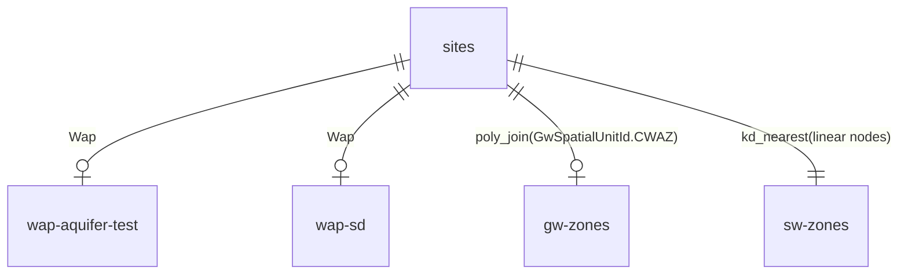

# diagraming

```mermaid
    erDiagram
      sites ||--o| wap-aquifer-test : Wap
      sites ||--o| wap-sd : Wap
      sites ||--o| gw-zones: "poly_join(GwSpatialUnitId.CWAZ)"
      sites ||--|| sw-zones: "kd_nearest(linear nodes)"
```

